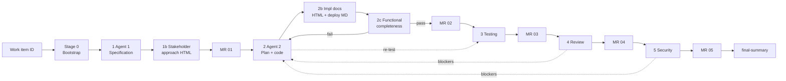

# Unified spec-driven SDLC pipeline (Cursor)

**One pipeline.** Bootstrap → agent stages (including custom agents 1b, 2b, 2c) → MR gates → hooks → final summary.

Active example: `specs/SUPPORT-2847/` (support ticket MVP)

---

## End-to-end flow



---

## Single stage map

| Stage | Agent | Workflow step | Primary outputs | Prompt | Hook milestone | MR |
|-------|-------|---------------|-----------------|--------|----------------|-----|
| 0 | Orchestrator | Init | `specs/<ID>/` | `orchestrator-bootstrap.md` | `.spec_created` | — |
| 1 | Ticket context | Specification | Spec files + `FUN-###` in `requirements.md` | `agent-1-spec-write.md` | `test-strategy.md` | |
| 1b | Stakeholder approach | Approach doc | `approach-document.html` | `agent-1b-stakeholder-approach.md` | `approach-document.html` | **01** |
| 2 | Implementation | Plan + code | `tasks.md`, code, `implementation-notes.md` | `task-decompose` / `task-execute` | (tasks in progress) | |
| 2b | Implementation docs | Technical docs | `technical-documentation.html`, `deployment-details.md` | `agent-2b-implementation-docs.md` | `technical-documentation.html` | |
| 2c | Functional verify | Pre-test gate | `functional-completeness-report.md` (`pass`/`fail`) | `agent-2c-functional-verification.md` | `functional-completeness-report.md` | **02** |
| 3 | Testing | Testing | `test-cases.md`, tests | `agent-3-testing.md` | `test-cases.md` | **03** |
| 4 | Review | Review + fix | `review-report.md` | `agent-4-review.md` | `review-report.md` | **04** |
| 5 | Security | Secure + fix | `security-audit.md` | `agent-5-security.md` | `security-audit.md` | **05** |
| 6 | — | Close | `final-summary.md` | — | — | merge |

**MR 01** covers stages 1 + 1b. **MR 02** covers stages 2 + 2b + 2c (2c must be `pass`). Update `spec-manifest.json` after each approved MR.

---

## Custom agents (summary)

| Agent | When | Output | Audience |
|-------|------|--------|----------|
| **1b** | Requirements finalized | `approach-document.html` | Technical + non-technical stakeholders |
| **2b** | Implementation done | `technical-documentation.html`, `deployment-details.md` | Devs, ops, release |
| **2c** | Before test cases | `functional-completeness-report.md` | Pipeline gate — verifies `FUN-###` in code |

**Functionality flows (`FUN-###`)** in `requirements.md` are the source of truth for Agent 2c.

---

## Quick start

```bash
./scripts/spec-bootstrap.sh PROJ-1234
```

Stages: 1 → 1b → MR01 → 2 → 2b → 2c → MR02 → 3 → 4 → 5

**Forbidden:** *"Build the complete application."*

---

## Fix loops

- **2c fail** → Agent 2 (new `T-###`) → 2b → 2c again  
- **4 / 5 blockers** → Agent 2 → 2b → 2c → Agent 3 → resume review/security  

---

## File index

| Path | Role |
|------|------|
| `PIPELINE.md` | This file |
| `agents.md` | Agent index |
| `prompts/agent-*.md` | Stage instructions |
| `steering/stakeholder-documentation.md` | Agent 1b rules |
| `steering/implementation-documentation.md` | Agent 2b rules |
| `steering/functional-verification.md` | Agent 2c rules |
| `templates/*.html` | HTML document templates |

## Integrations

| Tool | Setup |
|------|--------|
| **SpecStory** | Install extension `SpecStory.specstory-vscode`; sessions → `.specstory/history/` |
| **OpenSpec** | `npm install && npm run openspec:init` |

See `integrations/README.md`.

Governance: `AGENTS.md`
