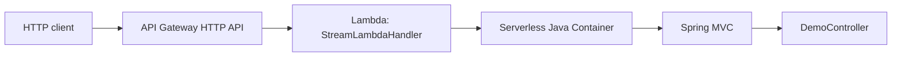

# Spring Boot on AWS Lambda — POC

This project demonstrates how a **Java Spring Boot** REST application can run as an **AWS Lambda** function behind **API Gateway**, using the official [**AWS Serverless Java Container**](https://github.com/aws/serverless-java-container) (Spring Boot 3 adapter).

It is a minimal teaching codebase: one Lambda handler, one `@RestController`, Maven packaging, and an optional AWS SAM template.

## Concepts (what “AWS functions” means here)

| Idea | In this POC |
|------|-------------|
| **AWS Lambda** | A function that runs your code on demand; you pay per invocation and duration. |
| **Function handler** | Java class method AWS invokes first — here `StreamLambdaHandler::handleRequest`. |
| **Event source** | **HTTP API (API Gateway)** sends each HTTP request as a **proxy event** (JSON). |
| **Serverless Java Container** | Bridges that event to the **Servlet / Spring MVC** stack so `@RestController` works. This POC uses **`getHttpApiV2ProxyHandler`** because SAM `HttpApi` sends **API Gateway v2** proxy events (REST API v1 would use `getAwsProxyHandler`). |
| **Cold start** | First request after idle may be slower while the JVM + Spring context start; keep beans lean. |
| **Warm reuse** | The static `HANDLER` keeps the Spring context alive for subsequent requests in the same environment. |

### Request flow



### Alternative: Spring Cloud Function

Spring also documents an adapter for **functional** beans (`Function`, `Consumer`, `Supplier`) on Lambda: [Spring Cloud Function — AWS](https://docs.spring.io/spring-cloud-function/reference/adapters/aws-intro.html). That style fits event-driven pipelines (SQS, Kinesis) more than “lift and shift” REST apps. This repo uses the **Serverless Java Container** path because it maps naturally to **existing Spring MVC** code.

## Project layout

| Path | Role |
|------|------|
| `AwsLambdaSpringPocApplication.java` | `@SpringBootApplication` entry point (also used to bootstrap Spring inside Lambda). |
| `StreamLambdaHandler.java` | Lambda **`RequestStreamHandler`**; proxies API Gateway events into Spring. |
| `api/DemoController.java` | Example JSON endpoints (`/api/hello`, `/api/demo/{id}`). |
| `pom.xml` | Dependencies + **Maven Shade** plugin (uber JAR; excludes embedded Tomcat modules from the shaded artifact per AWS guidance). |
| `template.yaml` | **AWS SAM** template: Lambda + HTTP API routes. |

## Prerequisites

- **JDK 17+** (template uses `java17`; you can switch to `java21` in `template.yaml` if your AWS account/runtime supports it).
- **Apache Maven** 3.9+.
- Optional: [**AWS SAM CLI**](https://docs.aws.amazon.com/serverless-application-model/latest/developerguide/install-sam-cli.html) for template validation, local invoke, and deploy (see **AWS SAM CLI** below).

## AWS SAM CLI

On this development machine, SAM was installed from the [official Linux x86_64 ZIP](https://github.com/aws/aws-sam-cli/releases) into **`~/.local/aws-sam-cli-poc`**, with the launcher at **`~/.local/bin/sam`**. Ensure `~/.local/bin` is on your `PATH`, or invoke it with the full path.

**Validate the template** (SAM needs a region even when you are not deploying):

```bash
export AWS_DEFAULT_REGION=us-east-1   # or your preferred region
sam validate --template template.yaml --region "$AWS_DEFAULT_REGION"
sam validate --template template.yaml --lint --region "$AWS_DEFAULT_REGION"
```

To **disable SAM CLI telemetry**, set `SAM_CLI_TELEMETRY=0` in your environment ([details](https://docs.aws.amazon.com/serverless-application-model/latest/developerguide/serverless-sam-telemetry.html)).

**Note:** If your project directory path contains **spaces**, do not run SAM’s bundled `install` script *from inside* that path (the script can mis-parse the path). Install to a path without spaces (for example `~/.local/aws-sam-cli-poc` as above).

## Build the deployable JAR

```bash
cd spring-boot-aws-lambda-poc
mvn -q clean package
```

The shaded artifact is written to:

`target/spring-boot-aws-lambda-poc-1.0.0-SNAPSHOT.jar`

Configure Lambda with:

- **Handler:** `com.example.awslambda.StreamLambdaHandler::handleRequest`
- **Runtime:** Java 17 (or 21)
- **Upload:** the JAR from `target/`

Wire **API Gateway** (HTTP API or REST API) with **Lambda proxy integration** so the event format matches `AwsProxyRequest` / `AwsProxyResponse`.

## Run locally as a normal Spring Boot app

Useful to verify controllers without AWS:

```bash
mvn spring-boot:run
```

Then open:

- http://localhost:8080/api/hello?name=Dev
- http://localhost:8080/api/demo/99

## Optional: SAM local API

After `mvn package`:

```bash
sam local start-api --template template.yaml
```

SAM emulates API Gateway + Lambda on your machine (Docker required for `sam local`).

## Optional: deploy with SAM

You need AWS credentials and an S3 bucket for SAM artifacts (replace placeholders):

```bash
sam deploy --guided \
  --template-file template.yaml \
  --stack-name spring-boot-lambda-poc \
  --capabilities CAPABILITY_IAM \
  --resolve-s3
```

Follow the prompts; SAM prints an **HttpApiUrl** output when finished.

## Tests

```bash
mvn test
```

## Files modified / added

This POC adds the entire `spring-boot-aws-lambda-poc/` tree (`pom.xml`, Java sources, `template.yaml`, `README.md`, tests).

## Further reading

- [Serverless Java Container — Spring Boot 3 quick start](https://github.com/aws/serverless-java-container/wiki/Quick-start---Spring-Boot3)
- [AWS Lambda — Java handler](https://docs.aws.amazon.com/lambda/latest/dg/java-handler.html)
- [Optimizing Java on Lambda (SnapStart, memory, etc.)](https://docs.aws.amazon.com/lambda/latest/dg/java-handler-performance.html)
